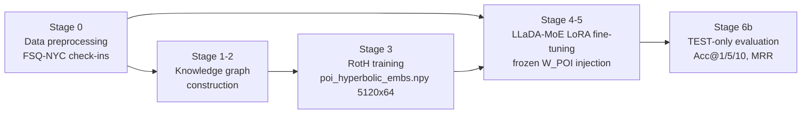

# Next-POI Recommendation with a Diffusion LLM and Hyperbolic Embeddings

**Project documentation — status as of 25 July 2026**
Follow-up to: *H-RLPOI: A Hybrid LLM and Reinforcement Learning Framework for Next POI Recommendation* (Hamdani, Zammali, Ben Yahia — COMPSAC 2026 submission).

> Sources: the Stage 6b evaluation notebooks + executed outputs (this folder), the H-RLPOI paper, and the GitHub repo [yosrkharrat/Diffusion-based-LLM-for-next-POI-](https://github.com/yosrkharrat/Diffusion-based-LLM-for-next-POI-) (stages 0–2, marked by the author as near-final drafts). Sections marked **⚠ TO FILL** correspond to the two stages whose notebooks are still only on Kaggle: **RotH training** and **LLaDA fine-tuning**.

---

## 1. Executive summary (the 60-second version)

We are extending H-RLPOI along two axes:

1. **Backbone: autoregressive → diffusion LLM.** Mistral-7B-Instruct is replaced by **LLaDA-MoE-7B-A1B-Instruct** (a masked-diffusion language model, 7B total / ~1B active parameters, MoE). Next-POI prediction maps naturally onto LLaDA's masked-token objective: the prompt ends with a single `<mask>` at the target position and the model fills it in — one forward pass, no autoregressive decoding.
2. **POI semantics: Euclidean text embeddings → hyperbolic knowledge-graph embeddings.** Instead of RoBERTa-MLM sentence embeddings, POIs are embedded with **RotH** (rotation-based hyperbolic KG embedding, Poincaré ball, curvature c = 1, d = 64) trained on a POI knowledge graph. Hierarchies (category taxonomies, spatial containment: venue ⊂ locality ⊂ region) embed with low distortion in hyperbolic space, which is the core scientific hypothesis of this work.

The injection mechanism is inherited from H-RLPOI: each of the 5,120 NYC POIs becomes a dedicated `<poi_i>` token, and a **frozen** embedding table `W_POI` (built from the hyperbolic embeddings via log-map + fixed random projection) serves those tokens at lookup time. Fine-tuning is parameter-efficient (LoRA + a trained POI scoring head) on Kaggle T4/GPU infrastructure.

**Headline result** (run 2, NYC, hyperbolic condition, `run2-ckpt` checkpoint, **full test set**, n = 29,071 — recovered from the Jul 17 Kaggle session):

| Split | Acc@1 | Acc@5 | Acc@10 | MRR |
|---|---|---|---|---|
| **test (full, 29,071)** | **0.1699** | **0.3462** | **0.4078** | **0.2508** |
| val (full, 14,719) | 0.1809 | 0.3775 | 0.4418 | 0.2703 |

⚠ **Crucial caveat: every checkpoint so far was trained on a 5% "fast-probe" subsample of the training split (5,133 of ~102.7k examples).** The full-data run (`SUBSAMPLE_FRAC=1.0`) was planned in the run-2 notebook's run plan but never executed. Test/val sets were always full. For calibration, H-RLPOI's non-RL ablations on FSQ-NYC scored Acc@1 0.13–0.19 (H-RLPOI-MS: 0.1886; H-RLPOI-TMS: 0.1744) — so a **5%-trained** diffusion + hyperbolic model already sits in the band of the paper's fully-trained non-RL variants. The full-data run is the largest untapped lever. (Split protocols also differ — 70/10/20 here vs 80/10/10 in the paper — see §7.3.)

---

## 2. Positioning relative to H-RLPOI

| Component | H-RLPOI (paper) | This project | Status |
|---|---|---|---|
| Backbone LLM | Mistral-7B-Instruct (autoregressive, d=4096) | LLaDA-MoE-7B-A1B-Instruct (masked diffusion, MoE, d=2048) | ✅ running |
| POI semantic embeddings | RoBERTa-base + dynamic-masking MLM on POI descriptions (d=768) | RotH hyperbolic KG embeddings (d=64, c=1) from a POI knowledge graph | ✅ trained |
| Injection | Vocabulary extension + frozen `W_POI`, linear projection RoBERTa→LLM space | Same mechanism; hyperbolic→tangent-space log-map at origin, then fixed random projection 64→2048, row-norm matched to base vocab | ✅ running |
| Prediction objective | SFT prompt → generate top-k candidate list (Chain-of-Draft) | Single masked target token; **restricted-logit ranking** over all 5,120 POIs via a trained scorer | ✅ running |
| Decision layer | PPO contextual bandit re-ranker over top-k | None yet (full ranking makes top-k metrics direct); RL layer is a possible later addition | ⏳ open |
| Fine-tuning | Full SFT | QLoRA (4-bit NF4 base, LoRA adapters) + trained scoring head | ✅ running |
| Datasets | FSQ-NYC + FSQ-TKY | FSQ-NYC (TKY planned) | ⏳ NYC only |

**Why a diffusion LLM?** (talking points for the meeting)
- The training/eval objective *is* the pre-training objective: predict a masked token from bidirectional context. No mismatch between "generate a ranked list as text" and "rank POIs" — the hidden state at the masked position is scored against all POIs directly, giving exact Acc@k/MRR without parsing generated text and without k-candidate truncation (addresses H-RLPOI challenge (iii) differently than PPO did).
- Bidirectional attention lets the target position attend to the entire prompt (profile + history + time) symmetrically.
- MoE with ~1B active params + 4-bit quantization makes it trainable/evaluable on free Kaggle T4s.

**Why hyperbolic embeddings?** POI relations are hierarchical (category trees, spatial containment). Euclidean space needs high dimension to embed trees with low distortion; hyperbolic space does it in few dimensions (here d = 64). RotH additionally models relations as rotations, capturing heterogeneous relation types in the KG. The experimental design directly tests this via the `EMB_CONDITION ∈ {hyperbolic, euclidean, random}` ablation switch built into the pipeline.

---

## 3. Pipeline overview



| Stage | What it does | Notebook | Key artifacts |
|---|---|---|---|
| 0 — Preprocessing | TSMC2014-NYC check-ins filtered + matched to FSQ-OS Places → text descriptions, vocab, 80/10/10 split | `stage0-data-preprocessing.ipynb` (GitHub) | `train/val/test_NYC.csv`, `poi_metadata_NYC.csv`, `vocab.pkl` (Kaggle dataset `yosrkharrat/kushflq`) |
| 1 — KG construction | Typed multi-relational POI knowledge graph (5 relation types) | `stage1-kg-construction.ipynb` (GitHub) | `kg_NYC.graphml`, `kg_NYC.gpickle` — 5,764 nodes / 132,799 edges |
| 2 — Hyperbolic ops | Poincaré-ball math module with self-checks (basis for RotH) | `stage2-hyperbolic-ops.ipynb` (GitHub) | tested ops: `project_to_ball`, `mobius_add`, `exp/log_map_zero`, `geodesic_distance`, `givens_rotation`, learnable curvature |
| 1v3 — KG v3 | Deeper KG: v2 relations + OSM admin hierarchy (supervisor request) | `notebook2d85f2bffc` (Kaggle, Jul 7) | `kg_NYC_v3.gpickle` — 7,287 nodes / 149,119 edges / 13 relations |
| 2-audit — Graph audit | Diagnose why RotH Hits@1 was low → 3 concrete fixes | `stage-2-graph-audit-lean-diagnostic` (Kaggle) | action plan (typed negatives, relation weighting, LR schedule) |
| 3/4 — RotH training | RotH link prediction on the KG; original (Jul 4) + audit-revised (Jul 8) runs | `stage-3-4-roth-model-training`, `stage-3-roth-model-definition` (Kaggle) | `roth_best.pt`, `poi_hyperbolic_embs.npy` — (5120, 64) |
| 5 — Extraction + ablation | Extract POI embeddings in poi_idx order; node2vec Euclidean ablation | `stage-5-embedding-extraction-euclidean-node2v` (Kaggle) | `node2vec_entity_embs.npy` (6837, 64), `ablation_results.json` |
| 4/5 — LLaDA fine-tuning (run 2) | QLoRA fine-tune LLaDA-MoE with frozen `W_POI` + trained scorer; saves `best/` (lowest val loss) and `latest/` | ⚠ TO FILL (on Kaggle) | HF repos `yosrr12/llada-moe-lora-run2-ckpt`, `yosrr12/llada-moe-lora-run2-NYC-hyperbolic-ckpt` (adapter + `poi_head.pt`, ~1.9 GB) |
| 6b — Evaluation | Rebuild identical pipeline, load checkpoint, restricted-logit ranking on val/test | `TEST_llada-moe-lora-run2-NYC-hyperbolic-ckpt.ipynb`, `TEST_llada-moe-lora-run2-ckpt.ipynb` (+ executed copies) | `test_results_*.json` in `/kaggle/working` |

### 3.1 Stage 0 — Data preprocessing (executed; numbers confirmed)

- **Source:** TSMC2014-NYC check-ins — 227,428 raw rows, 1,083 users, 38,333 venues, 2012-04-03 → 2013-02-16.
- **Filtering** (same thresholds as H-RLPOI): POIs ≥ 10 visits, users ≥ 30 visits → **147,699 check-ins, 1,073 users, 5,135→5,120 venues**.
- **Split:** per-user chronological **80/10/10** (this is the "stage-0 split" the run-2 evaluation later re-splits to 70/10/20). Val/test keep only users+venues seen in train → train 117,736 / val 14,657 / test 15,146 rows. Vocab = train venues sorted → `poi_idx` 0…5119.
- **FSQ-OS matching (novel engineering step):** each TSMC `venue_id` is matched against the **Foursquare Open Places** dataset (19 releases scanned via DuckDB): latest release (2026-06-11) matches **4,457/5,120 (87.1%)**; the remaining 663 are searched in up to 5 older releases (deprecated/merged venue ids), and anything still unmatched gets a placeholder description from its TSMC category name.
- **Text descriptions** in the H-RLPOI format, but with the **full category path** rather than the leaf: e.g. *"Kings Plaza Mall is a Retail > Shopping Mall located at 5100 Kings Plz, Brooklyn, NY."* Taxonomy depth distribution: 1-level 696, 2-level 1,588, 3-level 2,431, 4-level 384, 5-level 21 — this depth is exactly what the hyperbolic embedding is meant to exploit.
- **Sanity suite:** nulls, duplicate ids, cross-file consistency, Japanese/Han character check (3 residual bilingual venue names, benign), LLaDA-tokenizer length distribution, visits-per-POI (median 15, max 918) and visits-per-user (median 75, max 2,012) distributions.

### 3.2 Stage 1 — Knowledge-graph construction (executed; numbers confirmed)

Typed `networkx.MultiDiGraph` per dataset. **Nodes (5,764):** 5,120 POI, 500 Category (one node per hierarchy level, keyed by cumulative path), 142 Locality, 2 Region. **Edges (132,799):**

| Relation | Count | Semantics |
|---|---|---|
| `HAS_CATEGORY` | 5,120 | POI → leaf category (every POI covered) |
| `SUBCATEGORY_OF` | 417 | category child → parent chain |
| `LOCATED_IN` | 4,577 | POI → locality → region chain (689 placeholder POIs lack locality/region) |
| `IS_NEAR_TO` | 63,144 | k=10 haversine nearest neighbours, symmetric, weight 1/(1+km) |
| `FOLLOWED_BY` | 59,541 | user check-in transitions from **train only** (no leakage), weight = transition count, self-loops dropped |

The graph mixes the two hierarchies (category taxonomy, spatial containment) with flat relational structure (proximity, sequence) — the mix RotH's rotations + hyperbolic geometry are designed for.

### 3.3 Stage 2 — Hyperbolic operations module (executed; all self-checks pass)

Standalone, unit-tested Poincaré-ball toolkit used by RotH: `project_to_ball` (norm clamping at (1−1e-5)/√c), `mobius_add`, `exp_map_zero`/`log_map_zero` (verified mutually inverse), `geodesic_distance` (verified: d(x,x)=0, symmetry, and c→0 limit → 2×Euclidean with max error 5e-13), `givens_rotation` (verified isometry — the "Rot" in RotH), and `curvature_from_logit` (softplus-parameterised **learnable per-relation curvature**, strictly positive). The eval notebooks' `logmap0` is this module's `log_map_zero`.

### 3.4 Stage 1 v3 — Deeper KG with OSM admin hierarchy (executed, Jul 7; supervisor-requested)

Response to the supervisor's note that the KG was "too small / too shallow for RotH". Keeps all v2 relations verbatim (clean v2-vs-v3 ablation) and adds, from an OpenStreetMap BBBike extract: **`LOCATED_IN` rebuilt from OSM administrative boundary polygons** (143 polygons, admin levels 4–10; 85.5% of POIs covered vs the often-null FSQ locality fields), a **`PART_OF`** admin-containment tree, and **`NEAR_STATION`** (2,761 stations extracted, POI→station ≤500 m). Result: **7,287 nodes / 149,119 edges / 13 relation types** (also VISITED_AT_HOUR, VISITED_ON, HAS_POPULARITY, CO_VISITED_WITH, SAME_BRAND_AS, HAS_OSM_TAG); 0 isolated POIs, median POI degree 45; POI→admin hierarchy depth median 2, max 3. A **lean v3 variant** (7,140 nodes / 79,560 edges; only the 7 structural/spatial relations, no behavioral/temporal edges) is what RotH actually trained on after the audit.

### 3.5 Stage 2-audit — Graph audit (executed; drove the RotH revision)

Diagnosed why the first RotH run scored only Hits@1=0.062 on HAS_CATEGORY. Smoking gun: with uniform negative sampling only **7.0–7.4% of negatives for the hierarchical relations were even the correct node type**, so the model was learning *type separation, not hierarchy*; and IS_NEAR_TO comprised **79.3%** of edges, drowning the hierarchical signal. Verdicts: category hierarchy real-but-fragmented (83 components) → keep KG; degree tail slope −1.27; HAS_CATEGORY targets diffuse → keep global bias. Action plan: (1) **type-restricted negatives** for HAS_CATEGORY/SUBCATEGORY_OF, (2) **inverse-frequency relation weighting**, (3) cosine LR schedule.

### 3.6 Stages 3/4 — RotH training: original (Jul 4) vs audit-revised (Jul 8)

Common setup (both runs): **d=64** (lowered from 128; val loss 1.24→1.07), **learnable per-relation curvature** (init c≈1; *not* fixed), NSSA self-adversarial loss, 50 negatives/positive, batch 512, LR 1e-3, standard Adam + post-step projection onto the ball (no Riemannian optimizer), grad clip 1.0. Both runs were manually stopped around epoch 130 (of 500 / 150) with `roth_best.pt` kept.

| | Original (Jul 4) | Revised (Jul 8, per audit) |
|---|---|---|
| KG | v1-extended: 6,837 nodes / 145,437 edges / 6 rels (incl. User+VISITED, FOLLOWED_BY) | lean v3: 7,140 nodes / 79,560 edges / 7 structural rels |
| Negatives | type-constrained (all rels) | **category-pool-restricted** for HAS_CATEGORY/SUBCATEGORY_OF |
| Sampling | uniform | **inverse-frequency WeightedRandomSampler** |
| LR schedule | flat 1e-3 | cosine (T_max=150) |
| Extra | content-based POI init (MiniLM→PCA-64) | — |
| HAS_CATEGORY (filtered MRR / Hits@1) | 0.120 / 0.062 | **0.191 / 0.133** |
| LOCATED_IN (MRR) | 0.882 | **0.955** |
| SUBCATEGORY_OF (MRR) | 0.167 | **0.194** |

Learned curvatures (revised run) range 0.45–0.81 per relation. Embedding-quality probe: 10-NN neighbourhood purity = 9.2% same-category (5.7× over random) and **89.4% same-admin-area (11.3× over random)**. The revised notebook saves `poi_hyperbolic_embs.npy` (5120, 64) directly; its Jul 8 run date matches the Jul 8 upload of the `kushflq` dataset that the LLaDA stage consumes — so the **audit-fixed embeddings are (almost certainly) the ones injected into LLaDA**.

### 3.7 Stage 5 — Extraction + Euclidean (node2vec) ablation (executed, Jul 6)

Extracts POI rows in `poi_idx` order (fallbacks used: 0) and runs the geometry control: **node2vec (d=64, equal capacity, DeepWalk-style p=q=1) + TransE decoder** on the same graph and val split, walks built from train triples only (leakage guard). Result — overall link-prediction is a wash (RotH MRR 0.0943 vs node2vec 0.0928), but the **hyperbolic advantage concentrates exactly on the hierarchical relations**: ΔMRR **+0.077 on HAS_CATEGORY** (0.144 vs 0.067) and **+0.138 on SUBCATEGORY_OF** (0.150 vs 0.012), ≈0 on flat relations (LOCATED_IN +0.004, IS_NEAR_TO +0.008) and slightly negative on sequential ones. This is the paper's core-claim evidence at the embedding level. (Note: this ablation used the *Jul 4* checkpoint; re-running it against the revised Jul 8 embeddings is a cheap, worthwhile follow-up.)

---

## 4. Data and evaluation protocol (confirmed from executed notebooks)

- **Dataset:** Foursquare-NYC (TSMC2014 check-ins, enriched with FSQ-OS Places descriptions — see §3.1). **5,120 POIs**, 1,073 users, 147,699 check-ins after filtering; categories are full FSQ taxonomy paths (e.g. `Dining and Drinking > Bar > Cocktail Bar`).
- **Split:** per-user chronological **70/10/20** re-split ("run-2 re-split"), deterministic (stable mergesort, no RNG). Achieved fractions: train 0.703 / val 0.100 / test 0.197. This re-split changed 40.9% of check-in assignments vs the stage-0 split. Example counts: **val 14,719 / test 29,071**.
- **Example construction:** for every check-in i in the target split, history = previous ≤15 check-ins (`HIST_LEN=15`, crosses split boundaries — history is trajectory-wide), target = check-in i.
- **Causal user profile:** running counters over the strict prefix `seq[:i]` produce top-5 most-visited POIs, top-3 categories, top-3 hours. An automated **leakage assertion** verifies profile counts never exceed prefix length (passes).
- **Prompt format** (exactly as evaluated):

  ```
  You are a POI recommendation expert. Using the user's long-term profile and their recent check-ins, predict the next POI token.
  [user profile]
  check-ins so far: N
  most visited: <poi_a> (Category, xK), ...
  favourite categories: ...
  usual hours: 17:00, 18:00, 23:00
  [recent check-ins]
  <poi_4921> (Arts and Entertainment, 17:00)
  ...
  [current time] Thursday 1:00
  [next POI] <MASK>
  ```

  Mean prompt length ≈ 483 tokens, max ≈ 576 (budget `MAX_LEN=1024`). Batches are **left-padded with EOS** so the masked target sits flush right; LLaDA-MoE mask id **156895** (not 126336, which is the 8B-dense variant's).
- **Metrics:** the hidden state at the masked position is scored against **all 5,120 POIs** (restricted-logit ranking); rank of the true POI → Acc@1 / Acc@5 / Acc@10 / MRR. No sampling, no candidate lists, no text parsing. One forward pass per example, no gradients.

---

## 5. Model architecture (confirmed from notebooks)

### 5.1 Backbone and quantization
- `inclusionAI/LLaDA-MoE-7B-A1B-Instruct`, hidden size **H = 2048**, loaded 4-bit (NF4, double quant) via bitsandbytes; compute dtype fp16 on T4 (bf16 only on Ampere+). Fits a single T4 with ~4.8 GiB used.
- Pinned stack: `transformers==4.46.3`, `peft==0.13.2`, `tokenizers==0.20.3` + a small compat shim (`PreTrainedModel.all_tied_weights_keys`).

### 5.2 Token-level injection of hyperbolic POI embeddings
1. **Vocabulary extension:** 5,120 special tokens `<poi_0>…<poi_5119>` appended; contiguous id range `[157153, 162272]` (asserted), matching the paper's `[|V|, |V|+|P|−1]` scheme.
2. **Hyperbolic → tangent space:** `logmap0` (Poincaré log-map at the origin, c = 1, with ball-boundary clamping) maps the (5120, 64) RotH vectors to Euclidean tangent vectors.
3. **Projection:** a **fixed seeded random projection** `W ∈ R^{64×2048}` (scaled 1/√64, seed 42 — shared across conditions) maps into the LLM embedding space; rows are re-normalized to the mean row-norm of the original vocab (≈ 0.568) so POI tokens are statistically indistinguishable in scale from normal tokens.
4. **Frozen table + lookup-time substitution:** projected vectors initialise a separate `W_POI` (5120 × 2048, fp16, `requires_grad=False`). The base embedding `forward` is wrapped: ids inside the POI range route to `W_POI`, all other ids to the base table. Bounded on **both** sides so specials near the top of the vocab (incl. the mask id) can't be misrouted. No transformer internals are modified; the wrapper survives the PEFT wrap (asserted).

Ablation switch: `EMB_CONDITION ∈ {"hyperbolic", "euclidean", "random"}` — euclidean skips the log-map, random draws N(0, I) rows; same projection/norm treatment, so the conditions differ *only* in geometric content.

### 5.3 Output scorer (trained; stored in `poi_head.pt`)
Hidden state at masked position → `LayerNorm(H)` → two paths, `SCORING_MODE` read **from the checkpoint** (both runs: `'both'`):
- **head:** `Linear(2048 → 5120)` — a free, learned POI classifier.
- **tied:** `MLP 2048 → 1024 (GELU, LayerNorm) → 2048`, then dot-product against the **frozen** `W_POI` — this is the path through which hyperbolic geometry influences scoring at the output as well as the input.
- `both` = sum of the two logit sets.

Sanity asserts confirm the loaded head/tied-MLP are non-zero (i.e., genuinely trained). Eval bypasses the ~163k-vocab `lm_head` entirely (backbone forward only), which the notebook's warning documents: ranking on `lm_head`'s untrained POI rows gives ~random metrics.

### 5.4 Fine-tuning (run 2) — full training recipe (recovered from the Kaggle training notebooks, 25 Jul)

**Objective — single-token masked-diffusion SFT:** the prompt (profile + last-L check-ins + current time + `[next POI]`) is left-padded with EOS; **exactly one position per row — the appended target slot — carries `MASK_TOKEN_ID=156895`** ("N′=1, always masked"; the moot 1/t diffusion reweighting drops out). Loss = plain cross-entropy over the **5,120 restricted POI logits** from the §5.3 scorer at the masked position; the 163k-vocab `lm_head` is never used. Step-0 loss ≈ ln(5120) = 8.54 (zero-init heads), confirming clean initialization.

**Optimizer:** AdamW with two param groups — **LoRA adapters at LR=2e-5**, **from-scratch scorer at HEAD_LR=3e-4** (locked; run-1 evidence: 3e-4 descends cleanly, 5e-4 bounces). Linear schedule with 3% warmup, one scheduler scaling both groups. Grad clip 1.0, grad-accum 4 (effective batch 32), gradient checkpointing, 3 epochs, seed 42. From the Jul 18 job onward, **overfit guards**: weight decay 0.01 (LoRA) / 0.1 (head) + head dropout 0.1 — added after epoch 1 showed train≈1.3 vs val≈5.25 on the 5% subsample.

**LoRA:** r=16, α=32, dropout=0.05, bias none, targets `q/k/v/o_proj + gate/up/down_proj`, PEFT 0.13.2. Frozen `W_POI` throughout (no gradients — prevents semantic drift, as in the paper).

**Data:** ⚠ all executed runs used the fast-probe **`SUBSAMPLE_FRAC=0.05` → 5,133 train examples** (in-loop val capped at 2,000; test always full at 29,071). ~93 min/epoch on a T4 at that size. The full-data run was step 3 of the notebook's run plan and never happened.

**Checkpointing** (introduced Jul 17): each checkpoint = LoRA adapter + `poi_head.pt` (scoring_mode + poi_norm/head/proj) + `trainer_state.pt` (optimizer/scheduler, ~1.4 GB), pushed to a private HF repo under `latest/` (every N steps + epoch end) and `best/` (on val-loss improvement), with auto-resume from `latest/`. Push cost ≈3.4 GB each — later jobs push at epoch boundaries only.

---

## 6. Experiments run so far & results

### 6.0 Fine-tuning experiments — at a glance

**Shared setup (all experiments):** LLaDA-MoE-7B-A1B-Instruct, 4-bit QLoRA (r=16, α=32, attention + expert MLPs) + trained POI scorer; 5,120 `<poi_i>` tokens served from a **frozen** W_POI built from the hyperbolic RotH embeddings (64-d → projected to 2048-d); masked-diffusion SFT with a single always-masked target; 3 epochs; AdamW (LoRA 2e-5 / scorer 3e-4, 3% warmup); effective batch 32; seed 42; NYC (5,120 POIs); **trained on the 5% fast-probe subsample (5,133 examples)** — the full-data run has not happened yet. Metric = restricted-logit ranking over all 5,120 POIs.

| # | Experiment | Split | Profile in prompt | Output layer | History len | Regularization | Best result | Status |
|---|---|---|---|---|---|---|---|---|
| 1 | **Bare baseline** ("run 1") | 80/10/10 | ✗ | ✗ (ranks via LM head) | 15 | — | *lost* | trained ~Jul 10–13; checkpoint & metrics not preserved |
| 2 | **Main model** ("run 2") | 70/10/20 | ✓ | ✓ head + tied-MLP | 15 | none | **test Acc@1 0.1699 / MRR 0.2508** (full test, 29,071) | ✅ complete — best checkpoint |
| 3 | Run 2 + overfit guards | 70/10/20 | ✓ | ✓ | 15 | wd 0.01/0.1 + head dropout 0.1 | val Acc@1 0.1594 (full val) | val only; **worse ranking than #2 despite lower val loss** — guards rejected |
| 4 | Longer history (eval-only probe) | 70/10/20 | ✓ | ✓ | **30** (on #3's weights) | as #3 | val Acc@1 0.1680 (n=2k) | mismatched-history probe; degraded vs matched h15 (0.1940) → retrain required |
| 5 | Longer-history retrain | 70/10/20 | ✓ | ✓ | 30 | as #3 | — | ❌ crashed before first checkpoint; not retried |

**Configuration progression (the three-stage story):**

| # | Configuration | Split | Eval set | Acc@1 | Acc@5 | Acc@10 | MRR |
|---|---|---|---|---|---|---|---|
| 1 | No output layer, no user profile, last 15 | 80/10/10 | test — 2,000 | 0.0000 | 0.0000 | 0.0010 | 0.0013 ¹ |
| 2 | **+ output layer, + user profile, last 15** | **70/10/20** | **test — full (29,071)** | **0.1699** | **0.3462** | **0.4078** | **0.2508** |
| 3 | + output layer, + user profile, **last 30** | 70/10/20 | val — 2,000 | 0.1680 | 0.3560 | 0.4305 | 0.2555 ² |

¹ Random floor by construction, **not a trained baseline** — the LM-head POI rows of this checkpoint never received gradients. The genuine number for this configuration (the bare first experiment) was never preserved and needs a retrain.
² Not comparable to row 2: a **validation** measurement, on the *regularization-guards* checkpoint, feeding 30-visit prompts to a model trained on 15 — it measures prompt-length mismatch, not the benefit of longer history. The proper last-30 retrain never completed.
On the same test-2,000 subsample as row 1, row 2 scores 0.1770 / 0.3560 / 0.4165 / 0.2589 — use those for a strictly like-for-like row-1-vs-row-2 comparison.

**All experiment results (consolidated):**

| Experiment | Eval set | Acc@1 | Acc@5 | Acc@10 | MRR |
|---|---|---|---|---|---|
| **Full model** (70/10/20 + profile + output layer) | **test — full (29,071)** | **0.1699** | **0.3462** | **0.4078** | **0.2508** |
| Full model | val — full (14,719) | 0.1809 | 0.3775 | 0.4418 | 0.2703 |
| Full model | val — 2,000 cap | 0.1940 | 0.3925 | 0.4595 | 0.2843 |
| Full model + regularization guards | val — full (14,719) | 0.1594 | 0.3433 | 0.4186 | 0.2473 |
| Guards checkpoint, 30-visit history prompts | val — 2,000 | 0.1680 | 0.3560 | 0.4305 | 0.2555 |
| Full model (subsample re-check) | test — 2,000 | 0.1770 | 0.3560 | 0.4165 | 0.2589 |

*Not shown as results:* ranking through the LM head instead of the trained scorer gives the random floor (Acc@1 = 0.0000, MRR ≈ 0.0013–0.0019, measured) — **not a valid "no output layer" ablation**, since this checkpoint's LM-head POI rows were never trained (the loss only ever flowed through the scorer). It is a useful *sanity control* (confirms all ranking ability lives in the trained scorer, and that no signal leaks through the backbone alone), but the true no-output-layer number requires retraining the bare configuration.

Takeaways: (i) the trained output layer carries essentially all ranking ability — without it the model is at the random floor (random MRR ≈ 0.0017); (ii) the 2k subsample tracks the full test set (0.1770 vs 0.1699); (iii) regularization guards and longer history both *hurt* in their tested forms; (iv) everything above is from a 5%-trained model — the full-data run is the next experiment.

### 6.1 Checkpoints on Hugging Face (`yosrr12`, private) — **identification complete (HF API + Kaggle training notebooks, 25 Jul)**

| Repo | Created | Contents | What it actually is |
|---|---|---|---|
| `llada-moe-lora-run2-ckpt` | Jul 16 | `latest/` (+`best` tag internally) | **First completed run-2 training** (HIST_LEN=15, no weight-decay guards). Bootstrapped from a locally-saved epoch-1 checkpoint (val loss 5.2548) via manual resume, then epochs 2–3 pushed. **Has the only complete val+test eval.** |
| `llada-moe-lora-run2-NYC-hyperbolic-ckpt` | Jul 18–19 | `best/` + `latest/` | **Fresh 3-epoch retrain** with overfit guards (weight decay 0.01/0.1 + head dropout 0.1) and condition-scoped repo naming (so switching `EMB_CONDITION` can't silently resume another condition's weights). Best val loss 5.2414. |
| `llada-moe-lora-run2-NYC-hyperbolic-h30-ckpt` | Jul 19–20 | **empty** | Confirmed: the **HIST_LEN=30 retrain** (`create_repo` ran; session died before the first epoch-boundary push). Never trained. |

Same LoRA architecture across both trained repos (r=16, α=32, targets q/k/v/o+gate/up/down) — the *training* difference is the regularization guards and nothing else. Both hyperbolic condition, 70/10/20 re-split, profile, `scoring_mode='both'`, 5% train subsample.

**Which repo is the bare experiment? — None.** Run 1 (stage-0 split, no profile, `head`-only scoring) predates the HF checkpointing system entirely — no checkpoint, no saved metrics (Kaggle keeps only the latest kernel versions). The §6.4 comparison therefore runs as *eval-time* ablations, which is what `stage6c-quick-comparison.ipynb`'s default grid does.

### 6.4 Quick comparison on a test subsample (planned)

Decision (25 Jul): skip further ~2h full test passes — `run2-ckpt` already has a complete full-test result (§6.2); measure the upgrade ablation on a **seeded 2,000-example subsample** of the test split (~±2% absolute error on Acc@1, ~9 min/row on a T4). Notebook: `stage6c-quick-comparison.ipynb`, which applies the three run-2 upgrades cumulatively at eval time (recommended checkpoint: `run2-ckpt` `latest/` — it is the better-performing one and the one with the full-test anchor):

**Outcome (26 Jul, `run2-ckpt latest/`, seeded 2,000-example test subsample):**

- Full configuration: **Acc@1 0.1770 / Acc@5 0.3560 / Acc@10 0.4165 / MRR 0.2589** (n=2,000) — agrees with the full-test anchor (0.1699 on 29,071) within sampling error, validating the subsample protocol.
- The "no output layer" rows came out at the random floor (Acc@1 0.0000, MRR 0.0013–0.0019) — **retrospectively recognised as an invalid ablation**: this checkpoint's LM-head POI rows were never trained, so that pathway is guaranteed-random by construction. Kept only as a sanity control (all ranking ability lives in the trained scorer; nothing leaks through the backbone alone). The remaining *valid* eval-time ablations on this checkpoint — profile ON/OFF and 80/10/10 vs 70/10/20, both **with** the trained scorer — are still worth running (~7 min each).
- The true "no output layer" number requires retraining the bare configuration (run 1's checkpoint was never uploaded).

Caveats baked into the notebook (and worth repeating to the supervisor): these are *eval-time* ablations of a checkpoint *trained* with the full config — indicative, not equivalent to retraining each variant. The "no output layer" rows rank via `lm_head` POI rows that were never trained, so they will read near-random (≈0.0002) — since no bare checkpoint was ever uploaded (§6.1), that is the strongest available demonstration that the output layer carries the ranking; a genuinely trained bare number would require re-running the run-1 training.

### 6.2 Results — all recovered evaluations (consolidated 25 Jul from both Kaggle accounts)

All rows: NYC, hyperbolic condition, 70/10/20 re-split, profile prompt, `both` scorer, **model trained on the 5% subsample**.

| Checkpoint | Eval (source, date) | Split | n | Acc@1 | Acc@5 | Acc@10 | MRR |
|---|---|---|---|---|---|---|---|
| `run2-ckpt` (h15, no guards) | training notebook, Jul 17 | **test (FULL)** | 29,071 | **0.1699** | **0.3462** | **0.4078** | **0.2508** |
| `run2-ckpt` (h15, no guards) | training notebook, Jul 17 | val (2k cap) | 2,000 | 0.1940 | 0.3925 | 0.4595 | 0.2843 |
| `run2-ckpt` `latest/` | `output-run-2-test`, Jul 25 | val (full) | 14,719 | 0.1809 | 0.3775 | 0.4418 | 0.2703 |
| `hyperbolic-ckpt` `best/` (h15 + guards) | `stage6-test-output`, Jul 25 | val (full) | 14,719 | 0.1594 | 0.3433 | 0.4186 | 0.2473 |
| `hyperbolic-ckpt` `best/` — **h30 prompts** (mismatched) | Jul 19 session | val (2k cap) | 2,000 | 0.1680 | 0.3560 | 0.4305 | 0.2555 |

Readings:
- **The headline number is the full-test 0.1699 Acc@1 / 0.2508 MRR** — a complete, clean test evaluation, previously buried in an unsaved-then-saved Jul 17 session.
- **The regularization guards hurt ranking accuracy:** the Jul 18 retrain reached a *lower* best val loss (5.2414 vs 5.2548) but *worse* val Acc@1 (0.1594 vs 0.1809 on the full val set). Loss and ranking quality diverged — worth discussing (the guards may over-shrink the head that does the ranking).
- **Longer history (h30) evaluated zero-shot on an h15-trained checkpoint degrades accuracy** (0.1940 → 0.1680 on the 2k val); the proper h30 retrain never completed.
- Both Jul 25 test passes were interrupted (batch 200 and 1,800 of 3,634) — but the Jul 17 full-test result makes a re-run unnecessary for `run2-ckpt`; only `hyperbolic-ckpt` lacks a test number (and given its val deficit, it is not the checkpoint to headline anyway).

### 6.3 Test results on FSQ-NYC — paper-style comparison table

| Type | Method | Acc@1 | Acc@5 | Acc@10 | MRR |
|---|---|---|---|---|---|
| Classic NN-based | FPMC | 0.1003 | 0.2126 | 0.2970 | 0.1701 |
| | LSTM | 0.1305 | 0.2719 | 0.3283 | 0.1857 |
| | PRME | 0.1159 | 0.2236 | 0.3105 | 0.1712 |
| | STGCN | 0.1799 | 0.3425 | 0.4279 | 0.2788 |
| | PLSPL | 0.1917 | 0.3678 | 0.4523 | 0.2806 |
| | STAN | 0.2231 | 0.4582 | 0.5734 | 0.3253 |
| | GETNext | 0.2435 | 0.5089 | 0.6143 | 0.3621 |
| | STHGCN | 0.2734 | 0.5361 | 0.6244 | 0.3915 |
| Generative-based | LLM-Mob | 0.2343 | 0.5066 | 0.5660 | 0.3502 |
| | LLMMove | 0.1525 | 0.4429 | 0.5080 | 0.2690 |
| | LLM4POI | 0.3372 | 0.3982 | 0.5010 | 0.3807 |
| | GNPR-SID | 0.3618 | 0.4472 | 0.5521 | 0.4133 |
| | H-RLPOI (ours, prior — with PPO) | 0.3421 | — | — | — |
| | H-RLPOI-TMS (prior, no RL) | 0.1744 | 0.6050 | 0.6833 | 0.3382 |
| **This work** | **LLaDA-MoE + hyperbolic W_POI** † | **0.1699** | **0.3462** | **0.4078** | **0.2508** |

† Full test set (29,071 examples). Not yet directly comparable to the rows above: trained on a **5% subsample** of the training split, and evaluated under a 70/10/20 per-user chronological split (baselines: 80/10/10). Both gaps close with the planned full-data run and split alignment.

Honest read: a model trained on **5% of the training data** already matches H-RLPOI's fully-trained non-RL ablations. The two obvious levers, in order: (1) the never-executed **full-data run** (20× more training signal); (2) a decision layer / rank-aware objective (H-RLPOI's PPO was worth ~+0.17 Acc@1 there).

---

## 7. Engineering record (what broke and how it was fixed — worth 2 minutes in the meeting, it's reproducibility work)

1. **"Model loading takes forever" (run 2):** three compounding causes, all fixed in §0a of the eval notebooks: (i) anonymous HF downloads hit shared-IP rate limits on Kaggle → authenticate via Kaggle Secrets `HF_TOKEN`; (ii) the `hf_xet` transport stalls on Kaggle's ~4 vCPUs (observed wedged at ~200 MB of 14.7 GB) → `HF_HUB_DISABLE_XET=1` *before first hub import*; (iii) the `transformers==4.46.3` pin downgrades `huggingface_hub` across the 1.0 boundary → pre-download the full snapshot **before** the pin so `from_pretrained` is pure local I/O.
2. **Mixed/broken transformers install:** Kaggle's image ships a newer transformers; in-place downgrade leaves orphan files (`GGUF_TENSOR_MAPPING` ImportError). Fix: delete the package dirs outright, then clean-install the pinned stack, then verify the exact failing import chain.
3. **CUDA memory not freed after interrupting a cell:** IPython's cached exception traceback (`sys.last_traceback`) pins every local of every frame — including model/optimizer tensors. Fix: clear exception history + named globals + `empty_cache`, with a ≥6 GiB free-memory assert before loading.
4. **T4 ≠ bf16:** Turing has no bf16 tensor cores; auto-select fp16 on sm<80. "Single biggest wall-clock fix on Kaggle T4s."
5. **Silent-mismatch guards everywhere:** config asserts (§0a vs §1 repo/subfolder/model), contiguous-POI-id assert, non-zero head asserts, causality assert, `MASK_TOKEN_ID` documentation (156895 MoE vs 126336 dense), and the checklist cell mapping symptom → cause (~random metrics = head/adapter not loaded; plausible-but-low = `EMB_CONDITION`/`EMB_FILE`/split mismatch corrupting the tied path).

---

## 8. Experiment timeline (reconstructed 25 Jul from 32 notebooks across two Kaggle accounts)

| Date (2026) | Event |
|---|---|
| Jun 30 | First preprocessing attempt (`nyc-poi`/`tky-poi` JSONL datasets — NYC **and TKY**) |
| Jul 1 | `poi-diff`: direct TSMC→FSQ-OS ID join fails (4/38,333) → motivates the real matcher; first LLaDA-1.5 (8B dense) scaffold, later abandoned for LLaDA-MoE |
| Jul 3 | **Stage 0** final: FSQ-OS multi-release matching (87.1% + fallbacks), 5,120 POIs, 80/10/10 CSVs |
| Jul 4 | **Stage 1** KG v1/v1-extended; **first RotH training** (v1-ext KG, MiniLM content init; stopped ~epoch 130) |
| Jul 6 | **Stage 5**: embedding extraction + node2vec ablation → hyperbolic gain concentrated on hierarchical relations |
| Jul 7 | **Stage 1 v3**: OSM admin hierarchy (supervisor request) — 7,287 nodes / 149,119 edges / 13 relations |
| Jul 8 | **Stage 2 audit** findings applied → **revised RotH** on lean v3 (typed negatives, inverse-freq sampling, cosine LR): HAS_CATEGORY MRR 0.120→0.191; **`poi_hyperbolic_embs.npy` (5120×64) produced and uploaded to `kushflq` same day** |
| ~Jul 10–13 | **Run 1** (bare LLaDA-MoE: stage-0 split, no profile, `head` scoring, 5% probe) — notebook overwritten, no checkpoint/metrics survive; produced the HEAD_LR=3e-4 lesson and the motivation for the tied path |
| Jul 14 | **Run 2 v1** (`notebook2aad039c23`): epoch 1 done (val loss 5.2478), no HF checkpointing yet, session died |
| Jul 16 | Three aborted setup attempts (both accounts); checkpoint/resume system built; local epoch-1 rescued via manual resume → epochs 2–3 → **`run2-ckpt` pushed** |
| Jul 17 | Full eval of `run2-ckpt`: **test(29,071) Acc@1=0.1699 / MRR=0.2508**; val(2k) 0.1940/0.2843 |
| Jul 18–19 | Retrain with overfit guards → **`run2-NYC-hyperbolic-ckpt`** (best val loss 5.2414); condition-scoped repos introduced |
| Jul 19 | h30 prompts evaluated zero-shot on h15 checkpoint: val Acc@1 0.1680 (degradation) → h30 retrain planned |
| Jul 20 | h30 retrain launched, died before first push → **empty `h30-ckpt` repo** |
| Jul 25 | Full-val evals: `run2-ckpt` 0.1809, `hyperbolic-ckpt best/` 0.1594 (both test passes interrupted); **work consolidated into this document** |

## 9. Status, gaps, and proposed next steps

**Done ✅**
- Full pipeline: preprocessing → KG (v1→v3+OSM) → audit → RotH (revised) → extraction + node2vec ablation → LLaDA-MoE LoRA fine-tuning (run 2, two checkpoints) → leak-checked eval.
- **Complete test-set result: Acc@1 0.1699 / MRR 0.2508** (full 29,071 test examples) — with the model trained on only 5% of train.
- Embedding-level geometry evidence: hyperbolic beats equal-capacity node2vec exactly on hierarchical relations (ΔMRR +0.077 / +0.138).
- Reproducible Kaggle environment + HF checkpoint/resume system.

**Key gaps ⏳**
- **No full-data training run** (all checkpoints = 5% subsample) — the single biggest lever (~20× more signal).
- Geometry ablation at the LLaDA level (`euclidean`/`random` conditions) not yet trained.
- Regularization guards hurt ranking (val 0.1809 → 0.1594) despite lower val loss — unresolved.
- h30 retrain incomplete; run-1 baseline numbers lost (would need one cheap retrain to quantify the three run-2 upgrades properly).
- TKY untouched beyond raw data staging.

**Next 🎯 (proposed order)**
1. **Full-data run** (`SUBSAMPLE_FRAC=1.0`, no guards or milder guards, HIST_LEN=15) → re-eval. Everything else inherits from this number.
2. `stage6c-quick-comparison.ipynb` for the three-upgrade eval-time comparison table (§6.4) — cheap, useful for the meeting/paper narrative.
3. Geometry ablation: euclidean (node2vec) + random conditions through the same fine-tune, same seed/projection — the paper's central claim at the system level.
4. TKY replication (H-RLPOI's biggest win was TKY, +30% over GNPR-SID).
5. Optional: rank-aware objective or a re-ranking decision layer (H-RLPOI's PPO was ~+0.17 Acc@1).

**Questions for the supervisor**
- Report the 5%-trained test number now (with the caveat) and follow with the full-data run, or hold headline numbers until full training?
- Guards vs no guards: val loss improved but ranking degraded — keep the guards for the full run?
- 70/10/20 vs the paper's 80/10/10 — which protocol should the paper standardise on?
- Scope: diffusion-LLM-for-POI and hyperbolic injection together, or one as headline + one as ablation?
- Compute: ~93 min/epoch at 5%; full-data ≈ 30 h/epoch on a T4 — is university/SDU GPU time (L40S) available? Otherwise the full run needs gradient-accumulation tuning or a smaller full-data slice.

---

## 10. Artifact inventory

**Local (this folder / ~/Documents):**
- `Compsac_H-RLPOI_2026_.pdf` — prior paper (baseline + method heritage).
- `TEST_llada-moe-lora-run2-NYC-hyperbolic-ckpt.ipynb` — Stage 6b eval, hyperbolic `best/` (clean).
- `stage6-test-output.ipynb` — executed copy of the above (val metrics; test partial).
- `TEST_llada-moe-lora-run2-ckpt.ipynb` (~/Documents) — Stage 6b eval, `run2-ckpt latest/` (clean).
- `notebookd6d3fd6d40.ipynb` — executed copy of the above (test interrupted at ~50%).

**GitHub** ([yosrkharrat/Diffusion-based-LLM-for-next-POI-](https://github.com/yosrkharrat/Diffusion-based-LLM-for-next-POI-)): `stage0-data-preprocessing.ipynb`, `stage1-kg-construction.ipynb`, `stage2-hyperbolic-ops.ipynb` (near-final drafts with executed outputs).

**Kaggle** — full inventory recovered via API, 25 Jul (two accounts):

*Account `yosrkharrat` — key datasets (all private):*
| Dataset | Updated | Contents |
|---|---|---|
| `kushflq` | **Jul 8** | canonical bundle consumed by LLaDA stages: `train/val/test_NYC.csv`, `poi_metadata_NYC.csv`, `vocab.pkl`, **`poi_hyperbolic_embs.npy`** (exactly 5120×64 fp32) |
| `embedding-ext` | Jul 4 | **`roth_best.pt`** (Jul-4 run) + `kg_NYC (1).graphml` + `vocab.pkl` |
| `gpickle-st1` / `gpickle-kg` | Jul 7–8 | **`kg_NYC_v3`** graphml/gpickle + OSM admin geojson/features |
| `stage1-output` | Jul 7 | `NYC_bbbike.osm.pbf` (151 MB OSM extract) + v3 KG |
| `data-nyc` / `nycdata` | Jul 3–7 | stage-0 outputs (pre-`kushflq` copies) |
| `tsmc2014` (+2 dup uploads) | Jul 1 | raw TSMC2014 **NYC + TKY** check-in files |
| `nyc-poi` / `tky-poi` | Jun 30 | earliest JSONL preprocessing (train/val/test.jsonl + poi_vocab) — **TKY already staged here** |
| `gpick-em`, `kg-nyc-gpickle`, `nyc-gpickle`, `nyc-data` | Jul 3–4 | intermediate KG/CSV copies |

*Account `raedsaidi`:* the five Stage 6b run-2 **training jobs** (Jul 16–20 notebooks) — training ran on this second account for GPU quota; no POI datasets there.

Project-relevant notebooks on `yosrkharrat` (26 pulled): the named stage notebooks (`stage0-data-preprocessing`, `stage1-kg-construction`, `stage2-hyperbolic-ops`, `stage-2-graph-audit-lean-diagnostic`, `stage-3-4-roth-model-training`, `stage-3-roth-model-definition`, `stage-5-embedding-extraction-euclidean-node2v`, `notebook2d85f2bffc` = Stage 1 v3), the run-2 training/eval notebooks (`notebook2aad039c23`, `notebook3fd8758c2d`, `notebookfe4e1cd182`, `output-run-2-test`, `stage6-test-output`), and the project origin (`poi-diff`, `notebook16c4a89e5b`, Jul 1).

**Project origin (for the record):** `poi-diff` (Jul 1) tried a *direct* venue-ID join TSMC→FSQ-OS — it matched **4 of 38,333** venues (wrong cities; the ID spaces don't align via streaming lookup) — which motivated Stage 0's DuckDB multi-release matching pipeline (87.1% + fallbacks). Its second half is a GSAI-ML/**LLaDA-1.5 (8B dense)** fine-tune scaffold (QLoRA, never trained) — the project then switched to **LLaDA-MoE-7B-A1B** for the actual runs.

**Run 1 (bare experiment) — status:** the run-1 training notebook is **not present in either account's current notebook exports** (Kaggle keeps only latest versions; run 1 was likely an earlier version of a run-2 kernel). Its configuration is documented by reference in every run-2 notebook: stage-0 80/10/10 split, no profile, `SCORING_MODE="head"` (bias-free zero-init `Linear(H, N_POI)`), same LLaDA-MoE QLoRA + frozen `W_POI` + masked-diffusion SFT, 3 epochs, 5% train subsample fast-probe. **No run-1 metrics survive** and no run-1 checkpoint was uploaded. Run-1 lessons cited in run 2: HEAD_LR 3e-4 descends cleanly (5e-4 bounces); big train/val gap on the 5% subsample; `head`-only scoring could fit targets from context alone, making the hyperbolic-vs-random ablation uninformative — the motivation for run 2's tied path.

**Hugging Face** (`yosrr12`, private): `llada-moe-lora-run2-ckpt`, `llada-moe-lora-run2-NYC-hyperbolic-ckpt` (each: `adapter_config.json`, `adapter_model.safetensors`, `poi_head.pt`; `trainer_state.pt` in the training repos).

**Key config constants (run 2):** `DATASET=NYC`, `N_POI=5120`, `EMB=64-dim RotH, c=1.0`, `SEED=42`, `HIST_LEN=15`, `MAX_LEN=1024`, `PROFILE_TOP_K=5 / CATS=3 / HOURS=3`, `MASK_TOKEN_ID=156895`, `SCORING_MODE='both'`, `PROJ_HIDDEN=H//2=1024`, split `70/10/20`, eval `BATCH_SIZE=8`.
